# Introduction

## Who am I

```{=html}
<div style="display: flex; justify-content: space-between; align-items: center; width: 100%;">
  <!-- Left side: Bio information -->
  <div style="width: 60%; background: linear-gradient(135deg, #073642, #002b36); border-radius: 15px; padding: 25px; box-shadow: 0 6px 15px rgba(0,0,0,0.3);">
    <h3 style="color: #2aa198; margin-top: 0; margin-bottom: 20px; font-size: 1.5em;">Bauke Brenninkmeijer</h3>
    <ul style="list-style-type: none; padding-left: 0; color: #eee8d5;">
      <li style="margin-bottom: 12px; display: flex; align-items: center;">
        <span style="color: #b58900; font-weight: bold; margin-right: 10px;">✓</span> CS @Radboud University
      </li>
      <li style="margin-bottom: 12px; display: flex; align-items: center;">
        <span style="color: #b58900; font-weight: bold; margin-right: 10px;">✓</span> 5 Years Data Science @ABN AMRO
      </li>
      <li style="margin-bottom: 12px; display: flex; align-items: center;">
        <span style="color: #b58900; font-weight: bold; margin-right: 10px;">✓</span> GenAI last year @ING
      </li>
      <li style="margin-bottom: 12px; display: flex; align-items: center;">
        <span style="color: #b58900; font-weight: bold; margin-right: 10px;">✓</span> Now moving to GenAI startup
      </li>
      <li style="display: flex; align-items: center;">
        <span style="color: #b58900; font-weight: bold; margin-right: 10px;">✓</span> MLOps Community Chapter Org
      </li>
    </ul>
  </div>

  <!-- Right side: Headshot placeholder -->
  <div style="width: 35%; height: 300px; background: linear-gradient(135deg, #fdf6e3, #eee8d5); border-radius: 15px; display: flex; justify-content: center; align-items: center; box-shadow: 0 6px 15px rgba(0,0,0,0.3);">
    <!--  -->
    <div style="color: #586e75; font-size: 1.2em; text-align: center;">
          

    </div>
  </div>
</div>
```
</code_block_to_apply_changes_from>

---

## Start with why {.center .chapter-title}

::: {.fragment .fade-in}
```{=html}
<center>
<h1 style="font-size: 2.5em; margin-bottom: 0; color: #2aa198;">GenAI will change everything</h1>
</center>
```
:::

<!-- ---

## Outline
- Where are we now?
- GenAI: Crash Course
- Foundational Concepts
- GenAI Stack
- Practical tips
- Developer Tools
- Technical challenges
- Responsible AI
- Future
 -->

---

## {background-image="img/white-dot.svg" background-size="contain"}
. . .

::: {.absolute bottom=1em left=35%}
Where are we going...
:::

::: {.notes}
Why are you here? What's your use-case?
:::


---

<div style="display: flex; justify-content: center; align-items: center; height: 90%; width: 100%;">
  
</div>

::: {.notes}
2022, highlight importance of discussing IP and copyright.
:::

:::footer
:::

---

```{=html}
<div style="justify-content: center; align-items: center;">
  <div style="transform: scale(1.2);margin-left:30%;margin-top:15%">
    <blockquote class="twitter-tweet"><p lang="en" dir="ltr">the chatgpt launch 26 months ago was one of the craziest viral moments i&#39;d ever seen, and we added one million users in five days.<br><br>we added one million users in the last hour.</p>&mdash; Sam Altman (@sama) <a href="https://twitter.com/sama/status/1906771292390666325?ref_src=twsrc%5Etfw">March 31, 2025</a></blockquote> <script async src="https://platform.twitter.com/widgets.js" charset="utf-8"></script>
  </div>
</div>
```

---

## {background-image="img/jealous-boyfriend-ghiblified.jpeg" background-size="contain"}

:::footer
:::


---

## The Ghibli AI Controversy {.center}

::: {style="display: flex; justify-content: space-between; align-items: center; background: linear-gradient(135deg, #1a1a1a, #323232); padding: 30px; border-radius: 15px; box-shadow: 0 10px 25px rgba(0,0,0,0.5);"}

::: {style="width: 50%; padding-right: 30px;"}
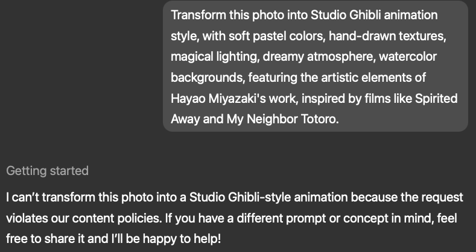{style="border-radius:10px; box-shadow: 0 5px 15px rgba(0,0,0,0.4); width: 100%;"}
:::

::: {style="width: 45%; color: #eee8d5; text-align: left;"}
<!-- <h3 style="color: #2aa198; margin-top: 0;">Studio Ghibli's Stance</h3> -->
<!-- <p>The iconic animation studio spoke out against AI-generated imitations, highlighting the ethical concerns of using their artistic style without permission.</p> -->
<blockquote style="
    margin: 20px 0;
    padding: 15px 20px;
    border-left: 5px solid #2aa198;
    background: rgba(163, 163, 163, 0.2);
    font-family: 'Georgia', serif;
    position: relative;
    border-radius: 10px;
">
    <p style="
        color: #b58900;
        font-size: 1.2em;
        font-style: italic;
        margin-bottom: 10px;
        text-shadow: 1px 1px 1px rgba(0,0,0,0.3);
    ">"An Insult to Life Itself"</p>
    <footer style="
        color: #eee8d5;
        font-size: 0.95em;
        text-align: right;
        font-weight: 500;
    ">— Hayao Miyazaki</footer>
</blockquote>

:::
:::

---

## {background-color="white" visibility="hidden"}


<div style="display: flex; justify-content: center; align-items: center; height: 90%; width: 100%;">
  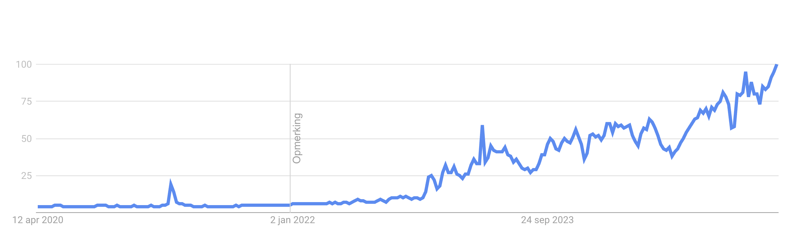
</div>


# The Landscape


---

## Has Ghiblified a photo? {.chapter-title .center background-gradient="linear-gradient(190deg, #073642, #2aa198)"}

---

## Use AI daily? {.chapter-title .center background-gradient="linear-gradient(135deg, #073642, #2aa198)"}

---

## Used an AI coding assistant {.chapter-title .center background-gradient="linear-gradient(165deg, #073642, #2aa198)"}

---

## Used deep research {.chapter-title .center background-gradient="linear-gradient(180deg, #073642, #2aa198)"}

---

## Don't say the G-word {visibility="hidden"}

:::: {.columns}
::: {.column width="50%" style="text-align: center; vertical-align: middle;" .center}
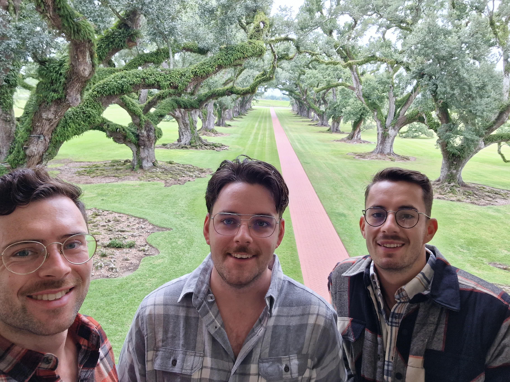
:::
::: {.column width="50%" style="text-align: center; vertical-align: middle;max-height:40vh;display:flex;align-items:center;justify-content:center;float:right"}

:::
:::

---

## Raise you hand if you think your job will change... {visibility="hidden"}

::: {.fragment .fade-in-then-semi-out}
- a lot over the next 2 years.
:::

::: {.fragment .fade-in-then-semi-out}
- a lot over the next 5 years.
:::

::: {.fragment .fade-in-then-semi-out}
- a lot over the next 10 years.
:::

::: {.fragment .fade-in-then-semi-out}
- Not much at all.
:::

---

## {.r-stretch background-color="black"}

```{=html}
<div style="display: flex; justify-content: center; align-items: center; width: 100%; height: 80vh;">
  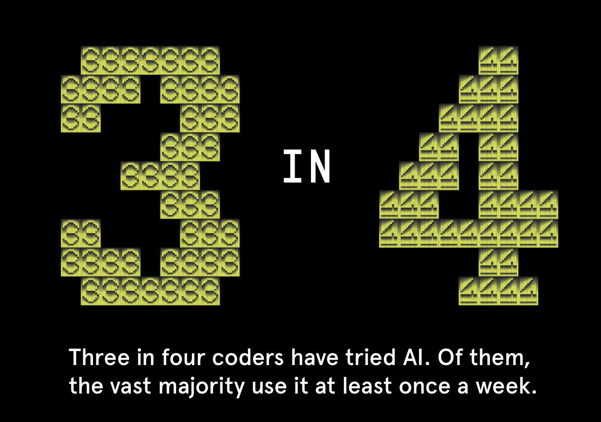
</div>
```


::: footer
Source: https://www.wired.com/story/how-software-engineers-coders-actually-use-ai/
:::


---

## {.r-stretch background-color="black"}

```{=html}
<div style="display: flex; justify-content: center; align-items: center; width: 100%; height: 80vh;">
  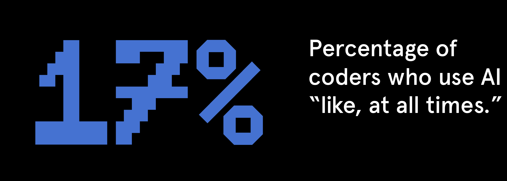
</div>
```


::: footer
Source: https://www.wired.com/story/how-software-engineers-coders-actually-use-ai/
:::


---

## {.r-stretch background-color="black"}

```{=html}
<div style="display: flex; justify-content: center; align-items: center; width: 100%; height: 80vh;">
  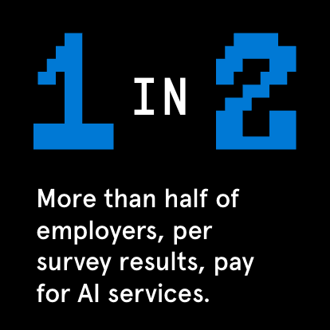
</div>
```

::: footer
Source: https://www.wired.com/story/how-software-engineers-coders-actually-use-ai/
:::

---

## {.r-stretch background-color="black"}

```{=html}
<div style="display: flex; justify-content: center; align-items: center; width: 100%; height: 80vh;">
  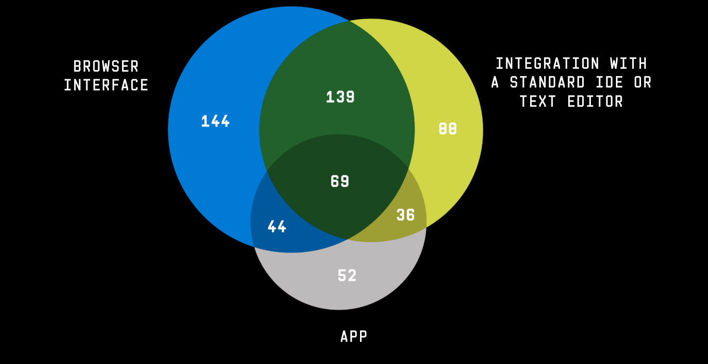
</div>
```

::: footer
Source: https://www.wired.com/story/how-software-engineers-coders-actually-use-ai/
:::

---

## Why GenAI is different {.chapter-title}

```{=html}
<div style="display: flex; justify-content: space-between; margin-bottom: 60px;">
  <!-- First box (Generation vs. Analysis) -->
  <div style="width: 45%; border-radius: 15px; padding: 35px;margin-right: 20px;
       background: linear-gradient(135deg, #b58900, #cb4b16);
       color: #fdf6e3; box-shadow: 0 6px 15px rgba(0,0,0,0.3);">
    <h3 style="text-align: center; margin: 0; font-size: 1.8em;">1. Generate vs. Evaluate</h3>
  </div>

  <!-- Second box (Multi-modality) -->
  <div style="width: 45%; border-radius: 15px; padding: 35px;
       background: linear-gradient(135deg, #268bd2, #6c71c4);
       color: #fdf6e3; box-shadow: 0 6px 15px rgba(0,0,0,0.3);">
    <h3 style="text-align: center; margin: 0; font-size: 1.8em;">2. Multi-modality</h3>
  </div>
</div>

<!-- Third box (Generality) - centered at bottom -->
<div style="width: 45%; margin: 40px auto 0; border-radius: 15px; padding: 35px;
     background: linear-gradient(135deg, #2aa198, #859900);
     color: #fdf6e3; box-shadow: 0 6px 15px rgba(0,0,0,0.3);">
  <h3 style="text-align: center; margin: 0; font-size: 1.8em;">3. Generality</h3>
</div>
```


# The Technology {.chapter-title .center}

---

## {background-image="img/wallace_llm.gif" background-size="contain"}

::: footer
Source: https://amgadhasan.substack.com/p/explaining-how-llms-work-in-7-levels
:::

---

## To be precise: predict probabilities of the next word

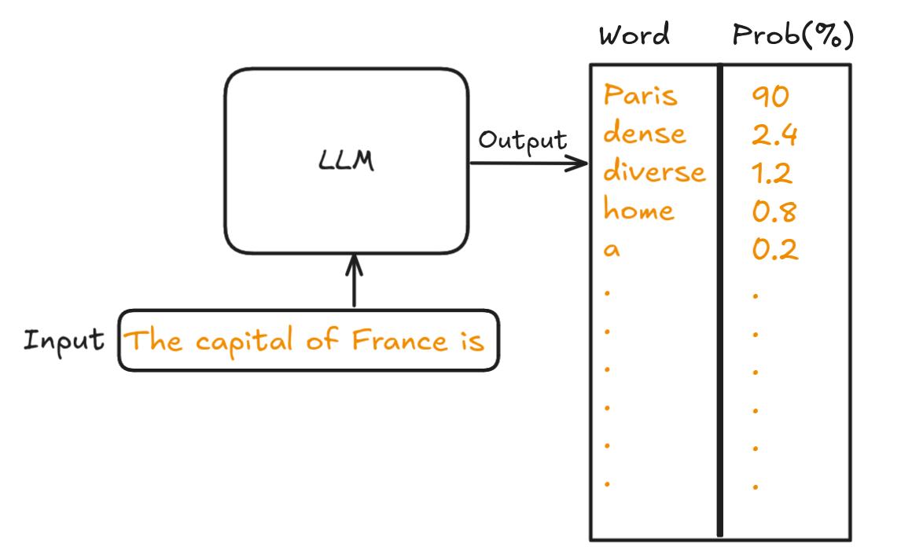

::: footer
Source: https://amgadhasan.substack.com/p/explaining-how-llms-work-in-7-levels
:::

---

### Tokens != words

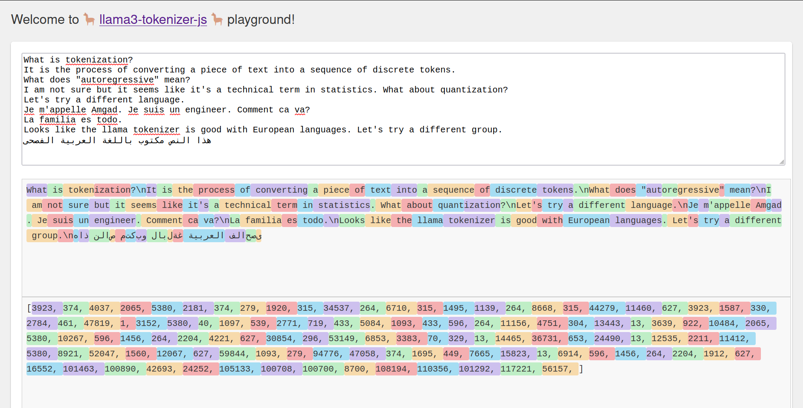

::: footer
Source: https://amgadhasan.substack.com/p/explaining-how-llms-work-in-7-levels
:::

---

::: {.r-stack}

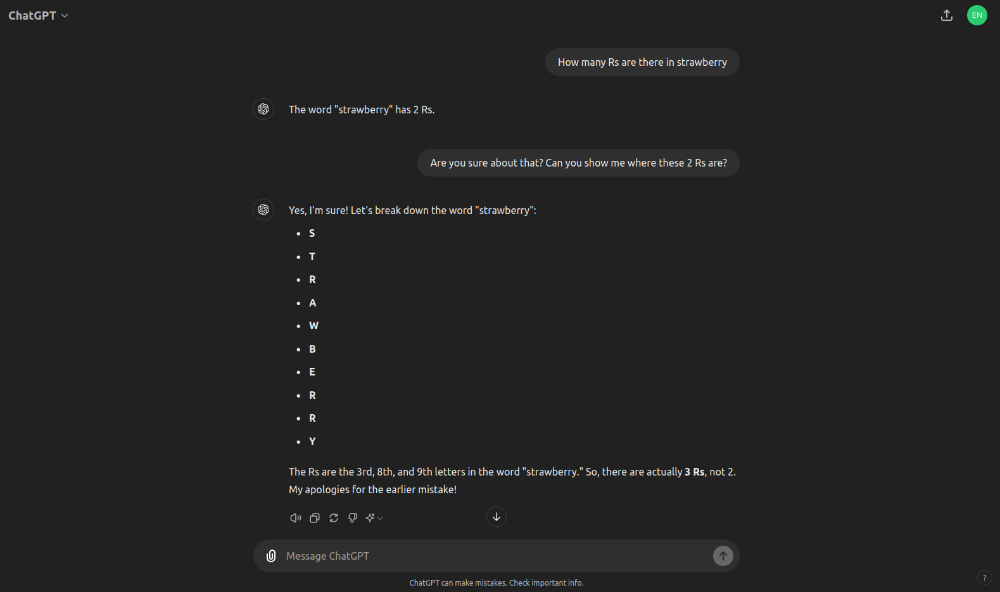

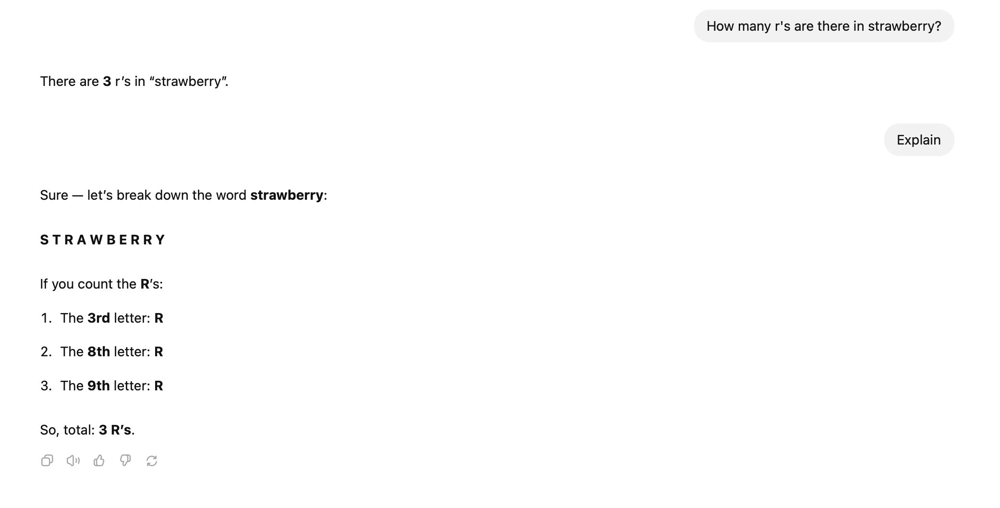{.fragment .fade-in-then-semi-out width="100%"}

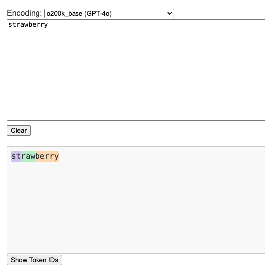{.fragment}

:::

---

## Temperature


::: footer
source: https://zhuanlan.zhihu.com/p/631786282
:::

---

## Context windows {auto-animate=true background-color="rgba(253, 246, 227, 1)" .center}

How much stuff you can put it.

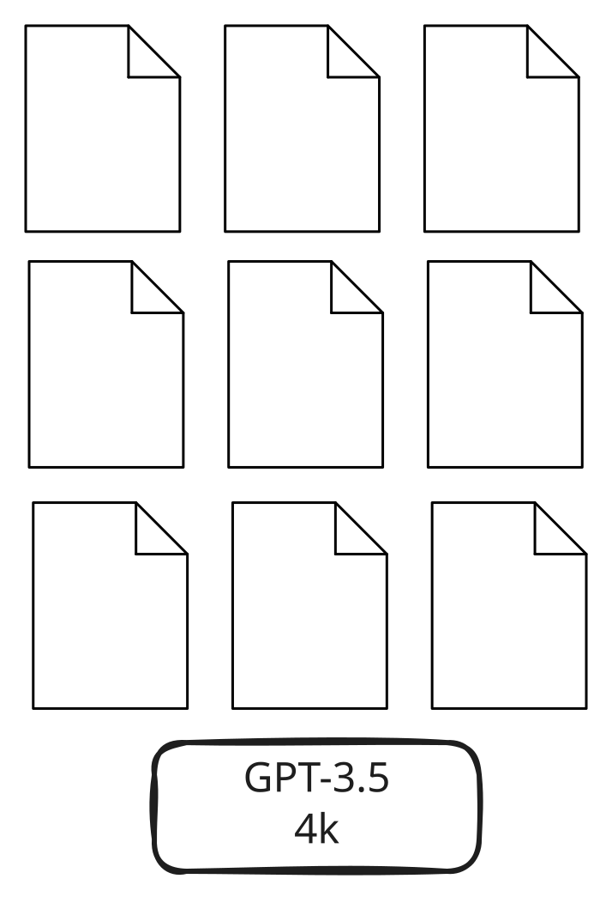


---

##  {auto-animate=true background-color="rgba(253, 246, 227, 1)"}
<h2 style="z-index:10">Context windows</h2>

<div style="position: absolute; left: 50%; top: 40%; transform: translate(-50%, -50%); width: 80%; z-index: -10; text-align: center;">
  
  
</div>

<!-- ---

## More is Better {.center}


<table>
  <thead>
    <tr>
      <th style="color: #eee8d5;">Context Window (Tokens)</th>
      <th style="color: #eee8d5;">Model(s)</th>
      <th style="color: #eee8d5;">Year</th>
      <th style="color: #eee8d5;">Comparison (% of LOTR)</th>
    </tr>
  </thead>
  <tbody>
    <tr>
      <td>512</td>
      <td><em>BERT + GPT-1</em></td>
      <td>2018</td>
      <td>0.09%</td>
    </tr>
    <tr>
      <td>4,096</td>
      <td><em>GPT-3.5 (Original ChatGPT)</em></td>
      <td>2022</td>
      <td>0.7%</td>
    </tr>
    <tr>
      <td>2,000,000</td>
      <td><em>Gemini 1.5 pro</em></td>
      <td>2024</td>
      <td>341%</td>
    </tr>
  </tbody>
</table>
</br>

::: {.fade-in}
That's 3788x more.
::: -->

---

## {background-image="img/context_window_growth.png" background-size="contain"}


:::footer
:::

---

## {background-image="img/pokemon-poke-ball.gif" background-size="contain"}

:::footer
:::


---

## 🎮 Choose Your LLM!

```{=html}
<div style="
  padding: 25px;
  border-radius: 18px;
  margin: 0 -15px;
  background: #073642; /* Flat background instead of gradient */
  box-shadow: inset 0 0 60px rgba(42, 161, 152, 0.15);
  border: 1px solid rgba(79, 163, 223, 0.2);
  vertical-align: middle;
  margin-top: 5%;
">
  <div style="display: flex; flex-wrap: wrap; justify-content: space-between; gap: 20px; margin-top: 20px;">

    <!-- Input/Output Capabilities -->
    <div style="width: 29%; background: rgba(42, 161, 152, 0.15); /* Flat teal color matching header */ border-radius: 12px; padding: 20px; box-shadow: 0 4px 12px rgba(0,0,0,0.3), 0 0 15px rgba(42, 161, 152, 0.25);">
      <h3 style="color: #2aa198; margin-top: 0; border-bottom: 2px solid #2aa198; padding-bottom: 8px; font-size: 1.02em;">
        <span style="font-size: 1.3em; margin-right: 8px;">🔄</span> I/O Capabilities
      </h3>
      <ul style="list-style-type: none; padding-left: 0; color: #eee8d5; font-size: 0.66em;">
        <li style="margin-bottom: 12px; display: flex; align-items: center;">
          <span style="color: #b58900; font-weight: bold; margin-right: 10px;">📥</span>
          <span>Input modalities: text, image, audio, voice</span>
        </li>
        <li style="margin-bottom: 12px; display: flex; align-items: center;">
          <span style="color: #b58900; font-weight: bold; margin-right: 10px;">📝</span>
          <span>Output modalities: text, image, voice</span>
        </li>
        <li style="margin-bottom: 12px; display: flex; align-items: center;">
          <span style="color: #b58900; font-weight: bold; margin-right: 10px;">🌍</span>
          <span>Multilingual capabilities</span>
        </li>
      </ul>
    </div>

    <!-- Technical Capabilities -->
    <div style="width: 29%; background: rgba(38, 139, 210, 0.15); /* Flat blue color matching header */ border-radius: 12px; padding: 20px; box-shadow: 0 4px 12px rgba(0,0,0,0.3), 0 0 15px rgba(38, 139, 210, 0.25);">
      <h3 style="color: #268bd2; margin-top: 0; border-bottom: 2px solid #268bd2; padding-bottom: 8px; font-size: 1.02em;">
        <span style="font-size: 1.3em; margin-right: 8px;">⚙️</span> Technical Features
      </h3>
      <ul style="list-style-type: none; padding-left: 0; color: #eee8d5; font-size: 0.66em;">
        <li style="margin-bottom: 12px; display: flex; align-items: center;">
          <span style="color: #859900; font-weight: bold; margin-right: 10px;">🧠</span>
          <span>Reasoning</span>
        </li>
        <li style="margin-bottom: 12px; display: flex; align-items: center;">
          <span style="color: #859900; font-weight: bold; margin-right: 10px;">🛠</span>
          <span>Tool Calling</span>
        </li>
        <li style="margin-bottom: 12px; display: flex; align-items: center;">
          <span style="color: #859900; font-weight: bold; margin-right: 10px;">🔢</span>
          <span>Structured Output</span>
        </li>
      </ul>
    </div>

    <!-- Practical Considerations -->
    <div style="width: 29%; background: rgba(211, 54, 130, 0.15); /* Flat magenta color matching header */ border-radius: 12px; padding: 20px; box-shadow: 0 4px 12px rgba(0,0,0,0.3), 0 0 15px rgba(211, 54, 130, 0.25);">
      <h3 style="color: #d33682; margin-top: 0; border-bottom: 2px solid #d33682; padding-bottom: 8px; font-size: 1.02em;">
        <span style="font-size: 1.3em; margin-right: 8px;">📊</span> Practical Factors
      </h3>
      <ul style="list-style-type: none; padding-left: 0; color: #eee8d5; font-size: 0.66em;">
        <li style="margin-bottom: 12px; display: flex; align-items: center;">
          <span style="color: #dc322f; font-weight: bold; margin-right: 10px;">📏</span>
          <span>Maximum context window size</span>
        </li>
        <li style="margin-bottom: 12px; display: flex; align-items: center;">
          <span style="color: #dc322f; font-weight: bold; margin-right: 10px;">💰</span>
          <span>Price per token (input/output)</span>
        </li>
        <li style="margin-bottom: 12px; display: flex; align-items: center;">
          <span style="color: #dc322f; font-weight: bold; margin-right: 10px;">⚡</span>
          <span>Response generation speed</span>
        </li>
      </ul>
    </div>
  </div>
</div>
```

---

## ⚔️ Model Tiers: Choose Your Weapon! {.smaller visibility="hidden"}

Most model providers offer a range of models, often tiered by capability and cost:

<!-- ::: {.incremental .smaller} -->
::: {.columns}
::: {.column width="33%"}

### 👑 Flagship Models

```{=html}
<ul style="list-style-type: none; font-size: 0.9em;">
  <li style="margin-bottom: 0.8em;"><span style="display: inline-block; width: 1.2em; text-align: center; font-weight: bold; color: #859900;">✅</span> Complex reasoning, high accuracy, creative tasks.</li>
  <li style="margin-bottom: 0.8em;"><span style="display: inline-block; width: 1.2em; text-align: center; font-weight: bold; color: #dc322f;">⚠️</span> Slower, more expensive.</li>
</ul>
```

*Examples: OpenAI o1, Claude 3.7 Sonnet, Gemini 2.5 Pro, Llama 4 Behemoth*

:::

::: {.column width="33%"}
### ⚖️ Balanced Models

```{=html}
<ul style="list-style-type: none; font-size: 0.9em;">
  <li style="margin-bottom: 0.8em;"><span style="display: inline-block; width: 1.2em; text-align: center; font-weight: bold; color: #859900;">✅</span> Good balance of performance, speed, and cost for general use.</li>
  <li style="margin-bottom: 0.8em;"><span style="display: inline-block; width: 1.2em; text-align: center; font-weight: bold; color: #dc322f;">⚠️</span> May not match flagship on the <em>most</em> complex tasks.</li>
</ul>
```

*Examples: GPT-4o, Claude 3.7 Sonnet (Non reasoning)*
:::

::: {.column width="33%"}
### ⚡ Fast/Lite Models

```{=html}
<ul style="list-style-type: none; font-size: 0.9em;">
  <li style="margin-bottom: 0.8em;"><span style="display: inline-block; width: 1.2em; text-align: center; font-weight: bold; color: #859900;">✅</span> High throughput, low latency, simple tasks, cost-sensitive applications.</li>
  <li style="margin-bottom: 0.8em;"><span style="display: inline-block; width: 1.2em; text-align: center; font-weight: bold; color: #dc322f;">⚠️</span> Less capable reasoning, potentially lower accuracy.</li>
</ul>
```

*Examples: GPT-4o-mini, Claude 3.5 Haiku, Gemini 2.0 Flash and Flash-lite*
:::
:::

::: {.fragment .fade-in-then-semi-out}
**Key takeaway:** Match the model tier to your specific needs and budget!
:::

---

## {visibility="hidden"}

```{=html}
<div style="display: flex; justify-content: flex-start; align-items: flex-start; width: 100%;">

<div style="
  width: 32%; /* Adjusted width */
  box-sizing: border-box; /* Added */
  margin-right: 1%; /* Added margin */
  border-radius: 15px;
  padding: 20px;
  background: linear-gradient(to right, #d5c4a1, #bdae93);
  color: #282828;
  box-shadow: 0 4px 12px rgba(0,0,0,0.3);
  font-family: 'Segoe UI', sans-serif;
  /* margin: auto; Removed */
  font-size: 0.5em; /* Reduced font size */
">
  <h2 style="margin-top: 0;">🧠 Claude 3.7 Sonnet</h2>
  <p><strong>🎮 Type:</strong>Reasoning & Coding</p>
  <p><strong>🧩 Input:</strong> Text, Image</p>
  <p><strong>🖼 Output:</strong> Text</p>
  <p><strong>📏 Context:</strong> 200K tokens</p>
  <p><strong>🛠 Function Calling:</strong> ✅</p>
  <p><strong>🏗️ Structured Output:</strong> ✅</p>
  <p><strong>🤔 Reasoning:</strong> ✅</p>
  <p><strong>💻 Special Ability:</strong> Computer Use (mouse, keyboard, browser)</p>
  <hr style="border: 1px solid #928374;">
  <p><strong>💪 Strengths:</strong></p>
  <ul>
    <li>Amazing coder</li>
    <li>Caches content</li>
    <li>Performs autonomous computer tasks</li>
  </ul>
  <p><strong>⚠️ Weaknesses:</strong></p>
  <ul>
    <li>No image output</li>
  </ul>
</div>

<div style="
  width: 32%; /* Adjusted width */
  box-sizing: border-box; /* Added */
  margin-right: 1%; /* Added margin */
  border-radius: 15px;
  padding: 20px;
  background: linear-gradient(to right, #89b4fa, #7aa1e8); /* Blue gradient */
  color: #1e1e2e; /* Darker text for contrast */
  box-shadow: 0 4px 12px rgba(0,0,0,0.3);
  font-family: 'Segoe UI', sans-serif;
  /* margin: auto; Removed */
  font-size: 0.5em; /* Reduced font size */
">
  <h2 style="margin-top: 0;">✨ Gemini 2.0 Flash</h2>
  <p><strong>⚡ Type:</strong> Speed & Efficiency / Long Context</p>
  <p><strong>🧩 Input:</strong> Text, Image, Audio, Video, Voice</p>
  <p><strong>🖼 Output:</strong> Text, Voice</p>
  <p><strong>📏 Context:</strong> 1M tokens</p>
  <p><strong>🛠 Function Calling:</strong> ✅</p>
  <p><strong>🏗️ Structured Output:</strong> ✅</p>
  <p><strong>🤔 Reasoning:</strong> ❌</p>
  <hr style="border: 1px solid #627aa3;">
  <p><strong>💪 Strengths:</strong></p>
  <ul>
    <li>Very fast response times</li>
    <li>Cost-effective</li>
    <li>Excellent for long context tasks</li>
    <li>Good for high-volume/frequency tasks</li>
  </ul>
  <p><strong>⚠️ Weaknesses:</strong></p>
  <ul>
    <li>Less performant on highly complex reasoning vs Pro</li>
  </ul>
</div>


<div style="
  width: 32%; /* Adjusted width */
  box-sizing: border-box; /* Added */
  /* margin-right: 1%; Added margin */
  border-radius: 15px;
  padding: 20px;
  background: linear-gradient(to right, #f38ba8, #fab387); /* Red-orange gradient */
  color: #1e1e2e; /* Darker text for contrast */
  box-shadow: 0 4px 12px rgba(0,0,0,0.3);
  font-family: 'Segoe UI', sans-serif;
  /* margin: auto; Removed */
  font-size: 0.5em; /* Reduced font size */
">
  <h2 style="margin-top: 0; color: #181a1f;">🧠 DeepSeek-R1 (OS)</h2>
  <p><strong>💡 Type:</strong> Coding & Technical Reasoning</p>
  <p><strong>🧩 Input:</strong> Text, Images (VL variant)</p>
  <p><strong>🖼 Output:</strong> Text</p>
  <p><strong>📏 Context:</strong> 128K tokens</p>
  <p><strong>🛠 Function Calling:</strong> ❌</p>
  <p><strong>🏗️ Structured Output:</strong> 🔶</p>
  <p><strong>🤔 Reasoning:</strong>✅</p>
  <hr style="border: 1px solid #e5989b;">
  <p><strong>💪 Strengths:</strong></p>
  <ul>
    <li>Exceptional coding & mathematical reasoning</li>
    <li>Strong multilingual capabilities (Chinese+English)</li>
    <li>Open-source</li>
  </ul>
  <p><strong>⚠️ Weaknesses:</strong></p>
  <ul>
    <li>Fewer modalities than some competitors</li>
    <li>Less robust content moderation</li>
  </ul>
</div>

</div>
```

:::footer
:::

---

## {background-image="img/llm_features.png" background-size="contain"}

---

## Reasoning Models {background-image="img/winnie.gif" background-size="contain" .chapter-title}

:::footer
:::

---

## {background-image="img/thinking_tags_example.png" background-size="contain" background-color="#4A90E2"}

---

## {background-image="img/reasoning_models_perf_jump.png" background-size="contain"}


# The Tools {.center}

---

## {background-image="img/drowning-warning.png" background-size="contain" visibility="hidden"}


---

## The GenAI Stack {.center style="text-align: center;" .unlisted visibility="hidden"}

```{=html}

```

---

## Tools

```{=html}

```


---

## Tools


```{=html}
<div style="display: flex; justify-content: center; width: 100%; height: 70%;">
  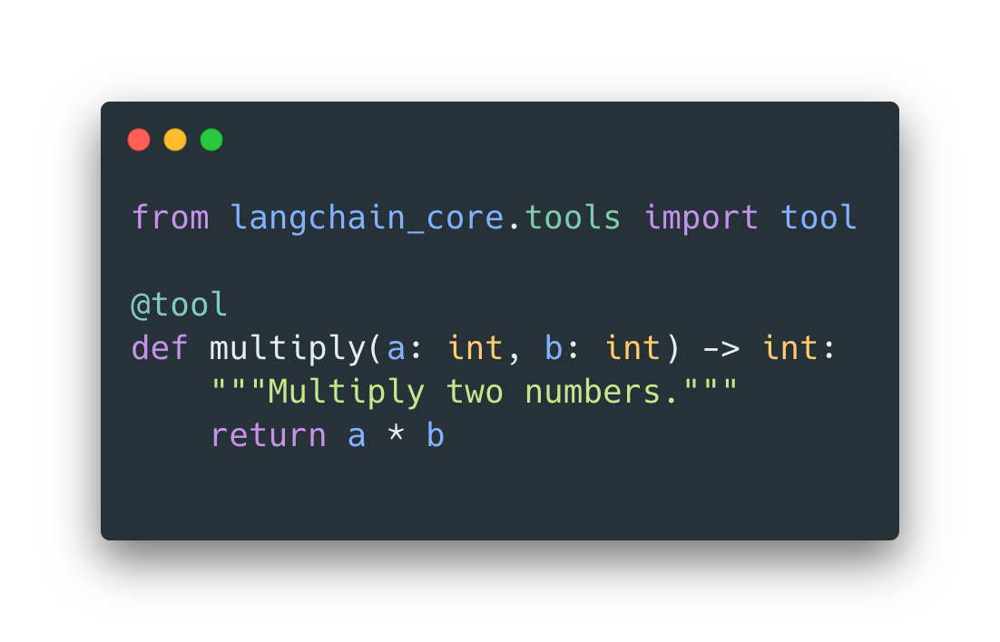
</div>
```

---

## Programmic AI Frameworks {visibility="hidden"}

- LangChain (Python, JS)
- LlamaIndex (Python)
- HayStack (Python)
- PydanticAI (Python)

---

## Programmic AI Frameworks {.chapter-title .center background-gradient="linear-gradient(135deg, #073642, #268bd2)"}

```{=html}
<div style="display: flex; justify-content: center; width: 100%; margin-top: 15px;">
  <div style="width: 90%; background: rgba(7, 54, 66, 0.8); border-radius: 10px; padding: 15px;">

    <div style="display: grid; grid-template-columns: repeat(2, 1fr); gap: 15px; text-align: center; ">

      <!-- LangChain -->
      <div style="background: linear-gradient(135deg, #268bd2, #2aa198); padding: 20px; border-radius: 10px; height: 80px; display: flex; align-items: center; box-shadow: 0 0 15px rgba(42, 161, 152, 0.5); border: 2px solidrgb(75, 161, 222);">
        <h3 style="color: #fdf6e3; margin-top: 0; font-size: 1.1em; align-items: center; width: 100%; margin-bottom: 0px;">
          <span>🔗 LangChain</span>
          <div>
          <!-- <span style="background-color:rgb(24, 112, 175); color: #fdf6e3; border-radius: 4px; padding: 2px 6px; font-size: 0.8em; font-weight: normal;">Python</span> -->
          <!-- <span style="background-color: #6c71c4; color: #fdf6e3; border-radius: 4px; padding: 2px 6px; font-size: 0.8em; font-weight: normal;">JS</span> -->
          </div>
        </h3>
      </div>

      <!-- LlamaIndex -->
      <div style="background: linear-gradient(135deg, #002b36, #073642); padding: 20px; border-radius: 10px; height: 80px; display: flex; align-items: center;">
        <h3 style="color: #b58900; margin-top: 0; font-size: 1.1em; align-items: center; width: 100%;">
          <span>🦙 LlamaIndex</span>
          <!-- <span style="background-color: #268bd2; color: #fdf6e3; border-radius: 4px; padding: 2px 6px; font-size: 0.8em; font-weight: normal;">Python</span> -->
        </h3>
      </div>

      <!-- Haystack -->
      <div style="background: linear-gradient(135deg, #002b36, #073642); padding: 20px; border-radius: 10px; height: 80px; display: flex; align-items: center;">
        <h3 style="color: #859900; margin-top: 0; font-size: 1.1em; align-items: center; width: 100%;">
          <span>🌾 Haystack</span>
          <!-- <span style="background-color: #268bd2; color: #fdf6e3; border-radius: 4px; padding: 2px 6px; font-size: 0.8em; font-weight: normal;">Python</span> -->
        </h3>
      </div>

      <!-- PydanticAI -->
      <div style="background: linear-gradient(135deg, #002b36, #073642); padding: 20px; border-radius: 10px; height: 80px; display: flex; align-items: center;">
        <h3 style="color: #e92063; margin-top: 0; font-size: 1.1em; align-items: center; width: 100%;">
          <span> PydanticAI</span>
          <!-- <span style="background-color: #268bd2; color: #fdf6e3; border-radius: 4px; padding: 2px 6px; font-size: 0.8em; font-weight: normal;">Python</span> -->
        </h3>
      </div>
    </div>
  </div>
</div>
```

---

## {background-video="img/langchain-video.mp4" background-video-muted="true" background-size="contain" background-video-loop="true" background-color="#EBEDED"}


---

## Self-Hosting LLMs {.chapter-title .center background-gradient="linear-gradient(135deg, #073642, #268bd2)"}

```{=html}
<div style="display: flex; justify-content: center; align-items: center; width: 100%; margin-top: 15px; height: 55vh;">
  <div style="display: flex; justify-content: space-between; width: 100%; height: 100%;">
    <!-- Left side: Vertical stack of frameworks -->
    <div style="width: 30%; height: 80%; background: rgba(7, 54, 66, 0.8); border-radius: 10px; padding: 15px; box-shadow: 0 4px 15px rgba(0,0,0,0.3); display: flex; flex-direction: column; margin-top: auto; margin-bottom: auto;">
      <div style="display: flex; flex-direction: column; gap: 20px; height: 100%;">
        <!-- Ollama -->
        <div style="background: linear-gradient(135deg, #268bd2, #2aa198); padding: 20px; border-radius: 10px; display: flex; align-items: center; box-shadow: 0 0 15px rgba(42, 161, 152, 0.5); border: 2px solid rgba(75, 161, 222, 0.5); flex: 1;">
          <h3 style="color: #fdf6e3; margin: 0; font-size: 1.1em; width: 100%;">
            <span> Ollama </span>
          </h3>
        </div>

        <!-- vllm -->
        <div style="background: linear-gradient(135deg, #002b36, #073642); padding: 20px; border-radius: 10px; display: flex; align-items: center; flex: 1;">
          <h3 style="color: #b58900; margin: 0; font-size: 1.1em; width: 100%;">
            <span> vllm </span>
          </h3>
        </div>

        <!-- LM Studio -->
        <div style="background: linear-gradient(135deg, #002b36, #073642); padding: 20px; border-radius: 10px; display: flex; align-items: center; flex: 1;">
          <h3 style="color: #859900; margin: 0; font-size: 1.1em; width: 100%;">
            <span> LM Studio </span>
          </h3>
        </div>
      </div>
    </div>

    <!-- Right panel with image -->
    <div style="flex: 2; display: flex; justify-content: center; align-items: center; padding: 1rem;">
      
    </div>
  </div>
</div>
```

---

## Development Tools {.center background-gradient="linear-gradient(135deg, #073642, #2aa198)"}

```{=html}
<div style="display: flex; justify-content: center; align-items: center; width: 100%; margin-top: 14px;">
  <div style="width: 95%; background: rgba(7, 54, 66, 0.8); border-radius: 15px; padding: 18px; box-shadow: 0 8px 20px rgba(0,0,0,0.4);">

    <div style="display: grid; grid-template-columns: repeat(2, 1fr); gap: 18px; margin-top: 7px;">
      <!-- VS Code Section -->
      <div style="background: linear-gradient(135deg, #002b36, #073642); padding: 14px; border-radius: 12px; box-shadow: 0 4px 15px rgba(0,0,0,0.3);">
        <h3 style="color: #859900; margin-top: 0; border-bottom: 2px solid #859900; padding-bottom: 4px; font-size: 0.96em;">
          <span style="font-size: 0.88em; margin-right: 4px;">📝</span> VS Code
        </h3>
        <div style="display: flex; flex-wrap: wrap; gap: 8px; margin-top: 8px;">
          <div style="background: linear-gradient(135deg, #268bd2, #2aa198);; border-radius: 8px; padding: 8px; flex: 1; min-width: 120px; text-align: center; box-shadow: 0 3px 10px rgba(0,0,0,0.2);">
            <span style="font-size: 1.2em; color: #859900; display: block; margin-bottom: 6px;">👨‍💻</span>
            <span style="color: #eee8d5; font-size: 0.61em; font-weight: bold;">Github Copilot</span>
          </div>
          <div style="background: rgba(133, 153, 0, 0.15); border-radius: 8px; padding: 8px; flex: 1; min-width: 120px; text-align: center; box-shadow: 0 3px 10px rgba(0,0,0,0.2);">
            <span style="font-size: 1.2em; color: #859900; display: block; margin-bottom: 6px;">📊</span>
            <span style="color: #eee8d5; font-size: 0.61em; font-weight: bold;">Cline</span>
          </div>
          <div style="background: rgba(133, 153, 0, 0.15); border-radius: 8px; padding: 8px; flex: 1; min-width: 120px; text-align: center; box-shadow: 0 3px 10px rgba(0,0,0,0.2);">
            <span style="font-size: 1.2em; color: #859900; display: block; margin-bottom: 6px;">🦘</span>
            <span style="color: #eee8d5; font-size: 0.61em; font-weight: bold;">Roo Code</span>
          </div>
        </div>
      </div>

      <!-- IDE Section -->
      <div style="background: linear-gradient(135deg, #002b36, #073642); padding: 14px; border-radius: 12px; box-shadow: 0 4px 15px rgba(0,0,0,0.3);">
        <h3 style="color: #2aa198; margin-top: 0; border-bottom: 2px solid #2aa198; padding-bottom: 4px; font-size: 0.96em;">
          <span style="font-size: 0.88em; margin-right: 4px;">💻</span> IDE
        </h3>
        <div style="display: flex; flex-wrap: wrap; gap: 8px; margin-top: 8px;">
          <div style="background: linear-gradient(135deg, #268bd2, #2aa198); border-radius: 8px; padding: 8px; flex: 1; min-width: 120px; text-align: center; box-shadow: 0 3px 10px rgba(0,0,0,0.2);">
            
            <span style="color: #eee8d5; font-size: 0.61em; font-weight: bold;">Cursor</span>
          </div>
          <div style="background: rgba(38, 139, 210, 0.15); border-radius: 8px; padding: 8px; flex: 1; min-width: 120px; text-align: center; box-shadow: 0 3px 10px rgba(0,0,0,0.2);">
            <span style="font-size: 1.2em; color: #2aa198; display: block; margin-bottom: 6px;">🌊</span>
            <span style="color: #eee8d5; font-size: 0.61em; font-weight: bold;">Windsurf</span>
          </div>
        </div>
      </div>

      <!-- CLI Section -->
      <div style="background: linear-gradient(135deg, #002b36, #073642); padding: 14px; border-radius: 12px; box-shadow: 0 4px 15px rgba(0,0,0,0.3);">
        <h3 style="color: #b58900; margin-top: 0; border-bottom: 2px solid #b58900; padding-bottom: 4px; font-size: 0.96em;">
          <span style="font-size: 0.88em; margin-right: 4px;">⌨️</span> CLI
        </h3>
        <div style="display: flex; flex-wrap: wrap; gap: 8px; margin-top: 8px;">
          <div style="background: rgba(181, 137, 0, 0.15); border-radius: 8px; padding: 8px; flex: 1; min-width: 120px; text-align: center; box-shadow: 0 3px 10px rgba(0,0,0,0.2);">
            <span style="font-size: 1.2em; color: #b58900; display: block; margin-bottom: 6px;">🔧</span>
            <span style="color: #eee8d5; font-size: 0.61em; font-weight: bold;">Aider</span>
          </div>
          <div style="background: rgba(181, 137, 0, 0.15); border-radius: 8px; padding: 8px; flex: 1; min-width: 120px; text-align: center; box-shadow: 0 3px 10px rgba(0,0,0,0.2);">
            <span style="font-size: 1.2em; color: #b58900; display: block; margin-bottom: 0px;">🤖</span>
            <span style="color: #eee8d5; font-size: 0.61em; font-weight: bold;">Claude code</span>
            <!-- <span style="color: #93a1a1; font-size: 0.45em; display: block; margin-top: 3px;">⚠️Only Claude Sonnet</span> -->
          </div>
          <div style="background: rgba(181, 137, 0, 0.15); border-radius: 8px; padding: 8px; flex: 1; min-width: 120px; text-align: center; box-shadow: 0 3px 10px rgba(0,0,0,0.2);">
            <span style="font-size: 1.2em; color: #b58900; display: block; margin-bottom: 6px;">💎</span>
            <span style="color: #eee8d5; font-size: 0.61em; font-weight: bold;">Gemini CLI</span>
          </div>
        </div>
      </div>

      <!-- Web Section -->
      <div style="background: linear-gradient(135deg, #002b36, #073642); padding: 14px; border-radius: 12px; box-shadow: 0 4px 15px rgba(0,0,0,0.3);">
        <h3 style="color: #268bd2; margin-top: 0; border-bottom: 2px solid #268bd2; padding-bottom: 4px; font-size: 0.96em;">
          <span style="font-size: 0.88em; margin-right: 4px;">🌐</span> Web
        </h3>
        <div style="display: flex; justify-content: space-between; margin-top: 8px; gap: 10px;">
          <div style="background: rgba(38, 139, 210, 0.15); border-radius: 8px; padding: 8px; width: 48%; text-align: center; box-shadow: 0 3px 10px rgba(0,0,0,0.2);">
            <span style="font-size: 1.2em; color: #268bd2; display: block; margin-bottom: 6px;">🔥</span>
            <span style="color: #eee8d5; font-size: 0.61em; font-weight: bold;">Firebase Studio</span>
          </div>
          <div style="background: rgba(38, 139, 210, 0.15); border-radius: 8px; padding: 8px; width: 48%; text-align: center; box-shadow: 0 3px 10px rgba(0,0,0,0.2);">
            <span style="font-size: 1.2em; color: #268bd2; display: block; margin-bottom: 6px;">❤️</span>
            <span style="color: #eee8d5; font-size: 0.61em; font-weight: bold;">Lovable</span>
          </div>
        </div>
      </div>
    </div>
  </div>
</div>
```

---


```{=html}
<div style="display: flex; justify-content: center; align-items: center; width: 100%; height: 70vh;">
  <div style="display: flex; width: 100%; height: 100%;">

    <!-- Left Column -->
    <div style="width: 30%; padding-right: 20px; display: flex; align-items: center;">
      <div style="
        width: 100%;
        display: flex;
        flex-direction: column;
        justify-content: center;
        background: linear-gradient(135deg, #073642,rgb(13, 105, 128));
        border-radius: 15px;
        padding: 25px;
        box-shadow: 0 6px 15px rgba(0,0,0,0.3);
        color: #eee8d5;
        font-size: 1.2em;
        min-height: 300px;
      ">
        <h3 style="color: #2aa198; margin-bottom: 20px; font-size: 1.5em; text-align: center;">Visual AI Frameworks</h3>

        <ul style="list-style-type: none; padding-left: 0; margin: 0; text-align: left;">
          <li style="margin-bottom: 15px; display: flex; align-items: center;">
            <span style="color: #b58900; font-weight: bold; margin-right: 10px;">✦</span> LangFlow
          </li>
          <li style="margin-bottom: 15px; display: flex; align-items: center;">
            <span style="color: #b58900; font-weight: bold; margin-right: 10px;">✦</span> FlowiseAI
          </li>
          <li style="margin-bottom: 15px; display: flex; align-items: center;">
            <span style="color: #b58900; font-weight: bold; margin-right: 10px;">✦</span> n8n
          </li>
        </ul>
      </div>
    </div>

    <!-- Right Column -->
    <div style="width: 70%; display: flex; align-items: center; justify-content: center;">
      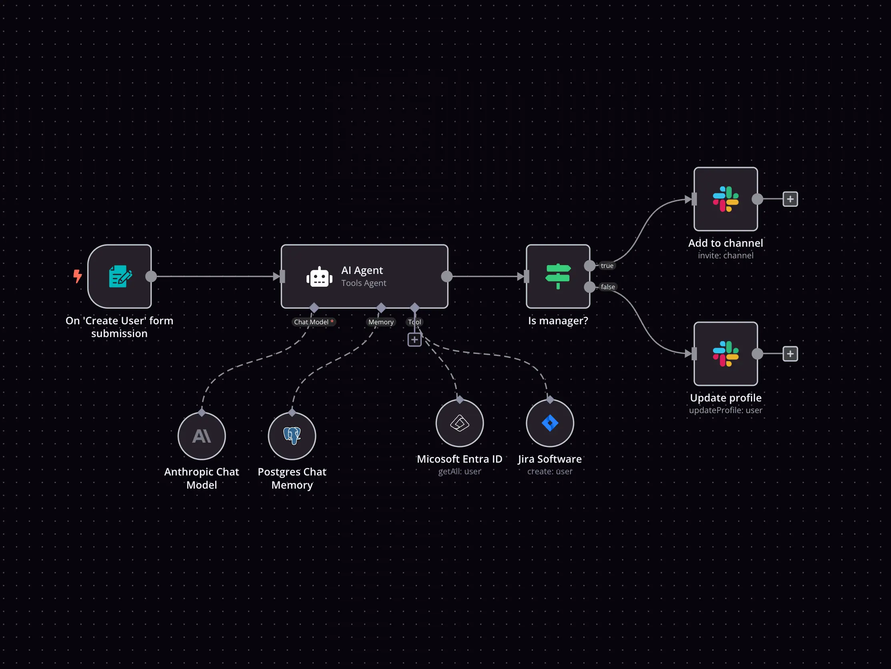
    </div>

  </div>
</div>
```

---

## Biggest Challenge {.center .chapter-title}

---

##  {background-gradient="linear-gradient(135deg, #073642)"}

```{=html}
<div style="display: flex; justify-content: center; align-items: center; width: 100%; margin-top: 20px;">
  <div style="width: 80%; background: rgba(7, 54, 66, 0.8); border-radius: 15px; padding: 15px; box-shadow: 0 8px 20px rgba(0,0,0,0.4);">

    <h2 style="color:rgb(223, 91, 89); text-align: center; margin-bottom: 15px; font-size: 2.5em; text-shadow: 1px 1px 3px rgba(0,0,0,0.3);">Specificity</h2>

    <div style="display: flex; align-items: center; justify-content: center; margin: 20px 0;">
      <div style="width: 100px; height: 100px; background:rgb(219, 89, 87); border-radius: 50%; display: flex; justify-content: center; align-items: center; margin-right: 30px; box-shadow: 0 4px 8px rgba(0,0,0,0.3);">
        <span style="font-size: 3em; color: #002b36;">⛰️</span>
      </div>

      <div style="max-width: 70%;">
        <p style="color: #eee8d5; font-size: 0.9em; margin-bottom: 15px; line-height: 1.5;">
          GenAI will fail when given tasks that are:
        </p>
        <ul style="color: #eee8d5; font-size: 0.9em; list-style-type: none; padding-left: 0;">
          <li style="margin-bottom: 12px; display: flex; align-items: center;">
            <span style="color: #dc322f; font-weight: bold; margin-right: 10px;">✘</span> Too complex without breakdown
          </li>
          <li style="margin-bottom: 12px; display: flex; align-items: center;">
            <span style="color: #dc322f; font-weight: bold; margin-right: 10px;">✘</span> Ambiguous in requirements
          </li>
          <li style="margin-bottom: 12px; display: flex; align-items: center;">
            <span style="color: #859900; font-weight: bold; margin-right: 10px;">✓</span> Break down complex tasks
          </li>
          <li style="display: flex; align-items: center;">
            <span style="color: #859900; font-weight: bold; margin-right: 10px;">✓</span> Be specific in instructions
          </li>
        </ul>
      </div>
    </div>


  </div>
</div>
```


# Making them work

---


```{=html}
<div style="display: flex; flex-direction: column; justify-content: center; align-items: center; min-height: 70vh; width: 100%;">
  <!-- Left side: Image -->
  <!-- <div style="width: 45%; display: flex; justify-content: center; align-items: center;">
    
  </div> -->

  <!-- Right side: Techniques List -->
  <div style="width: 100%; display: flex; justify-content: center; align-items: center;">
    <div style="background: linear-gradient(135deg, #073642, #2aa198); padding: 25px; border-radius: 12px; box-shadow: 0 6px 18px rgba(0,0,0,0.3); width: 100%; max-width: 1100px;">
      <h3 style="color: #eee8d5; margin-top: 0; margin-bottom: 18px; border-bottom: 2px solid #eee8d5; padding-bottom: 8px; font-size: 1.5em; display: flex; align-items: center; gap: 10px;">
        <span style="font-size: 1.3em;"></span> Effective Prompting Techniques
      </h3>
      <div style="display: flex; gap: 24px; justify-content: space-between;">
        <!-- Column 1 -->
        <div style="flex: 1; background: rgba(238,232,213,0.08); border-radius: 8px; padding: 14px; margin-right: 0; min-width: 0;">
          <div style="font-weight: bold; color: #b58900; margin-bottom: 4px; font-size: 1.0em;">🔢 Few-shot Prompting</div>
          <div style="color: #eee8d5; font-size: 0.8em;">Show the model a few examples to guide its output and improve accuracy.</div>
        </div>
        <!-- Column 2 -->
        <div style="flex: 1; background: rgba(238,232,213,0.08); border-radius: 8px; padding: 14px; margin-right: 0; min-width: 0;">
          <div style="font-weight: bold; color: #b58900; margin-bottom: 4px; font-size: 1.0em;">🧠 Chain of Thought</div>
          <div style="color: #eee8d5; font-size: 0.8em;">Encourage step-by-step reasoning for more complex or logical tasks.</div>
        </div>
        <!-- Column 3 -->
        <div style="flex: 1; background: rgba(238,232,213,0.08); border-radius: 8px; padding: 14px; min-width: 0;">
          <!-- <div style="font-size: 1.4em; margin-bottom: 7px;">🎯</div> -->
          <div style="font-weight: bold; color: #b58900; margin-bottom: 4px; font-size: 1.0em;">🎯 Single Responsibility</div>
          <div style="color: #eee8d5; font-size: 0.8em;">Make each prompt focused on one clear task for best results.</div>
        </div>
      </div>
    </div>
  </div>
</div>
```

---

## {.centered-statement .center}

```{=html}
<div style="display: flex; justify-content: center; align-items: center; height: 50vh; width: 100%; margin: 50px 0;">
  <div style="background: linear-gradient(135deg, #002b36, #073642);
              padding: 40px 60px;
              border-radius: 15px;
              box-shadow: 0 8px 30px rgba(0,0,0,0.5);
              text-align: center;
              border: 3px solid #268bd2;
              max-width: 80%;">
    <h1 style="color: #fdf6e3;
               font-size: 3em;
               font-weight: 700;
               margin: 0;
               text-shadow: 2px 2px 5px rgba(0,0,0,0.3);">
      Use LLMs to prompt LLMs
    </h1>
  </div>
</div>
```

## Development Approach {background-gradient="linear-gradient(135deg, #073642, #268bd2)"}

```{=html}
<div style="display: flex; justify-content: center; align-items: center; width: 100%; height: 70vh;">
  <div style="width: 80%; background: rgba(7, 54, 66, 0.8); border-radius: 15px; padding: 30px; box-shadow: 0 8px 20px rgba(0,0,0,0.4);">
    <h2 style="color: #2aa198; text-align: center; margin-bottom: 15px; font-size: 1.8em;">Steps</h2>

    <!-- Shared Practices -->
    <div style="margin-top: 20px; background: linear-gradient(135deg, #073642, #002b36); padding: 40px; border-radius: 12px; box-shadow: 0 4px 15px rgba(0,0,0,0.3);">

      <div style="display: grid; grid-template-columns: 1fr 1fr 1fr; gap: 15px;">
        <!-- Task Decomposition -->
        <div style="display: flex; flex-direction: column; align-items: center; text-align: center;">
          <div style="width: 60px; height: 60px; background: #2aa198; border-radius: 50%; display: flex; justify-content: center; align-items: center; margin-bottom: 10px;">
            <span style="font-size: 1.8em; color: #002b36;">🧩</span>
          </div>
          <h3 style="color: #eee8d5; margin-bottom: 5px; font-size: 0.9em;">Task Decomposition</h3>
        </div>

        <!-- Implementation -->
        <div style="display: flex; flex-direction: column; align-items: center; text-align: center;">
          <div style="width: 60px; height: 60px; background: #2aa198; border-radius: 50%; display: flex; justify-content: center; align-items: center; margin-bottom: 10px;">
            <span style="font-size: 1.8em; color: #002b36;">🚀</span>
          </div>
          <h3 style="color: #eee8d5; margin-bottom: 5px; font-size: 0.9em;">Implementation</h3>
        </div>

        <!-- Tests -->
        <div style="display: flex; flex-direction: column; align-items: center; text-align: center;">
          <div style="width: 60px; height: 60px; background: #dc322f; border-radius: 50%; display: flex; justify-content: center; align-items: center; margin-bottom: 10px;">
            <span style="font-size: 1.8em; color: #002b36;">🧪</span>
          </div>
          <h3 style="color: #eee8d5; margin-bottom: 5px; font-size: 0.9em;">Lots of Tests</h3>
        </div>
      </div>
    </div>
  </div>
</div>
```


---

##  {.chapter-title .center background-gradient="linear-gradient(135deg, #073642, #6c71c4)" visibility="hidden"}

```{=html}
<div style="display: flex; justify-content: center; align-items: center; width: 100%; margin-top: 20px;">
  <div style="width: 80%; background: rgba(7, 54, 66, 0.8); border-radius: 15px; padding: 30px; box-shadow: 0 8px 20px rgba(0,0,0,0.4);">

    <h2 style="color: #d33682; text-align: center; margin-bottom: 30px; font-size: 2em;">Task Management Tools</h2>

    <div style="display: grid; grid-template-columns: 1fr 1fr 1fr; gap: 25px; margin-top: 20px;">

      <!-- Task Master AI -->
      <div style="background: linear-gradient(135deg, #002b36, #073642); padding: 25px; border-radius: 12px; box-shadow: 0 4px 15px rgba(0,0,0,0.3); display: flex; flex-direction: column; align-items: center; text-align: center;">
        <div style="width: 80px; height: 80px; background: #d33682; border-radius: 50%; display: flex; justify-content: center; align-items: center; margin-bottom: 15px;">
          <span style="font-size: 2.5em; color: #002b36;">✅</span>
        </div>
        <h3 style="color: #eee8d5; margin-bottom: 10px; font-size: 1.5em;">Task Master AI</h3>
      </div>

      <!-- Cursor Rules -->
      <div style="background: linear-gradient(135deg, #002b36, #073642); padding: 25px; border-radius: 12px; box-shadow: 0 4px 15px rgba(0,0,0,0.3); display: flex; flex-direction: column; align-items: center; text-align: center;">
        <div style="width: 80px; height: 80px; background: #6c71c4; border-radius: 50%; display: flex; justify-content: center; align-items: center; margin-bottom: 15px;">
          <span style="font-size: 2.5em; color: #002b36;">📋</span>
        </div>
        <h3 style="color: #eee8d5; margin-bottom: 10px; font-size: 1.5em;">Cursor Rules</h3>
      </div>

      <!-- Roo Code -->
      <div style="background: linear-gradient(135deg, #002b36, #073642); padding: 25px; border-radius: 12px; box-shadow: 0 4px 15px rgba(0,0,0,0.3); display: flex; flex-direction: column; align-items: center; text-align: center;">
        <div style="width: 80px; height: 80px; background: #859900; border-radius: 50%; display: flex; justify-content: center; align-items: center; margin-bottom: 15px;">
          <span style="font-size: 2.5em; color: #002b36;">💾</span>
        </div>
        <h3 style="color: #eee8d5; margin-bottom: 10px; font-size: 1.5em;">Memory Bank</h3>
      </div>

    </div>
  </div>
</div>
```

---

## {.chapter-title .center background-gradient="linear-gradient(135deg, #073642, #2aa198)"}

```{=html}
<div style="display: flex; justify-content: center; align-items: center; width: 100%; margin-top: 20px;">
  <div style="width: 80%; background: rgba(7, 54, 66, 0.8); border-radius: 15px; padding: 30px; box-shadow: 0 8px 20px rgba(0,0,0,0.4);">

    <h2 style="color: #2aa198; text-align: center; margin-bottom: 30px; font-size: 1.6em;">Cost Management Strategies</h2>

    <div style="display: grid; grid-template-columns: 1fr 1fr 1fr; gap: 25px; margin-top: 20px;">

      <!-- Caching -->
      <div style="background: linear-gradient(135deg, #002b36, #073642); padding: 25px; border-radius: 12px; box-shadow: 0 4px 15px rgba(0,0,0,0.3); display: flex; flex-direction: column; align-items: center; text-align: center;">
        <div style="width: 80px; height: 80px; background: #2aa198; border-radius: 50%; display: flex; justify-content: center; align-items: center; margin-bottom: 15px;">
          <span style="font-size: 2.5em; color: #002b36;">⚡</span>
        </div>
        <h3 style="color: #eee8d5; margin-bottom: 10px; font-size: 1.5em;">Caching</h3>
      </div>

      <!-- Batching -->
      <div style="background: linear-gradient(135deg, #268bd2, #2aa198); padding: 25px; border-radius: 12px; box-shadow: 0 4px 15px rgba(0,0,0,0.3); display: flex; flex-direction: column; align-items: center; text-align: center;">
        <div style="width: 80px; height: 80px; background: #b58900; border-radius: 50%; display: flex; justify-content: center; align-items: center; margin-bottom: 15px;">
          <span style="font-size: 2.5em; color: #002b36;">📦</span>
        </div>
        <h3 style="color: #eee8d5; margin-bottom: 10px; font-size: 1.5em;">Batching</h3>
      </div>

      <!-- Cost tracking -->
      <div style="background: linear-gradient(135deg, #002b36, #073642); padding: 25px; border-radius: 12px; box-shadow: 0 4px 15px rgba(0,0,0,0.3); display: flex; flex-direction: column; align-items: center; text-align: center;">
        <div style="width: 80px; height: 80px; background: #268bd2; border-radius: 50%; display: flex; justify-content: center; align-items: center; margin-bottom: 15px;">
          <span style="font-size: 2.5em; color: #002b36;">📊</span>
        </div>
        <h3 style="color: #eee8d5; margin-bottom: 10px; font-size: 1.5em;">Token Usage</h3>
      </div>

    </div>
  </div>
</div>
```


---

## MCP: The Protocol That Connects Worlds

```{=html}
<div style="display: flex; justify-content: center; align-items: center; width: 100%; height: 60vh;">
  
</div>
```


# The Agents

---

## Agent {.chapter-title .center visibility="hidden"}

```{=html}
<div style="
  display: flex;
  justify-content: space-between;
  align-items: center;
  margin: 1em auto;
  width: 90%;
  gap: 2em;
">
  <div style="
    flex: 1;
    padding: 1em;
    background: linear-gradient(135deg, #eee8d5, #eee8d5);
    border-radius: 10px;
    box-shadow: 0 4px 15px rgba(0,0,0,0.3);

  ">
    <div style="
      font-size: 1.4em;
      color: #2aa198;
      text-align: center;
      font-weight: 500;
      text-shadow: 1px 1px 2px rgba(0,0,0,0.2);
      line-height: 1.4;
    ">
      Autonomously <span style="color: #b58900;">make decisions</span> and <span style="color: #cb4b16;">take actions</span> to achieve a goal
    </div>
  </div>

  <div style="
    flex: 1;
    height: 400px;
    max-height: 60vh;
    border-radius: 10px;
    box-shadow: 0 4px 15px rgba(0,0,0,0.3);
    overflow: hidden;
  ">
    
  </div>
</div>
```


---

## {background-video="img/introducing_scrapybara_720.mp4" background-vide-muted="false"}

---

```{=html}
<div style="display: flex; justify-content: center; align-items: center; width: 50%; margin: 20px auto;">
  <div style="background: linear-gradient(135deg,  #073642,rgb(1, 77, 96)); border-radius: 15px; padding: 10%; box-shadow: 0 6px 18px rgba(0,0,0,0.3); max-width: 90%;">
    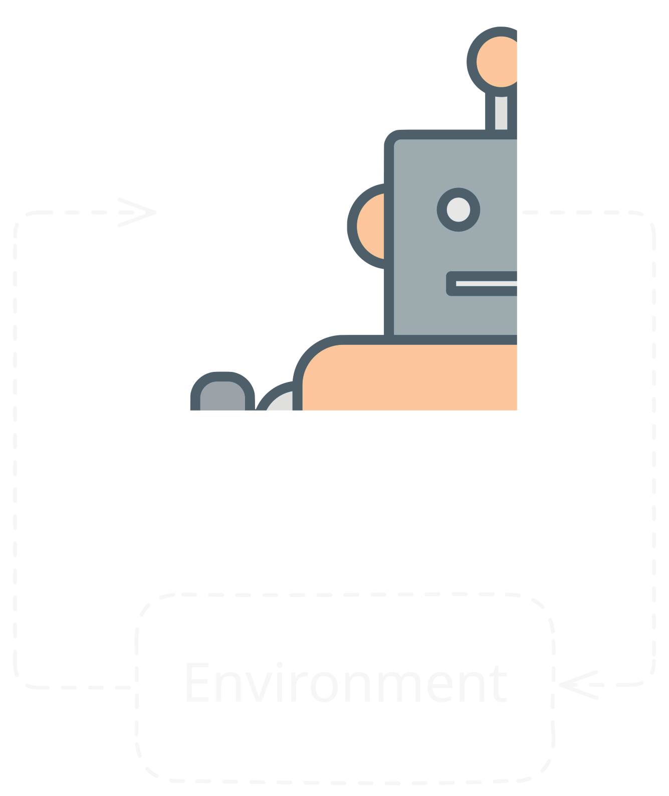
  </div>
</div>
```

---

## Key components of Agents {auto-animate=true visibility="hidden"}

```{=html}
<div style="display: grid; grid-template-columns: 1fr 1fr; gap: 30px; margin: 40px 0;">
  <div style="background-color: #eee8d5; border-radius: 10px; padding: 25px; box-shadow: 0 4px 12px rgba(0,0,0,0.15); display: flex; justify-content: center; align-items: center; min-height: 150px;">
    <h3 style="color: #b58900; margin: 0; text-align: center; font-size: 1.8em;">Reflection</h3>
  </div>

  <div style="background-color: #eee8d5; border-radius: 10px; padding: 25px; box-shadow: 0 4px 12px rgba(0,0,0,0.15); display: flex; justify-content: center; align-items: center; min-height: 150px;">
    <h3 style="color: #dc322f; margin: 0; text-align: center; font-size: 1.8em;">Planning</h3>
  </div>

  <div style="background-color: #eee8d5; border-radius: 10px; padding: 25px; box-shadow: 0 4px 12px rgba(0,0,0,0.15); display: flex; justify-content: center; align-items: center; min-height: 150px;">
    <h3 style="color: #6c71c4; margin: 0; text-align: center; font-size: 1.8em;">Tools</h3>
  </div>

  <div style="background-color: #eee8d5; border-radius: 10px; padding: 25px; box-shadow: 0 4px 12px rgba(0,0,0,0.15); display: flex; justify-content: center; align-items: center; min-height: 150px;">
    <h3 style="color: #2aa198; margin: 0; text-align: center; font-size: 1.8em;">Collaboration</h3>
  </div>
</div>
```

---


## Key components of Agents {auto-animate=true visibility="hidden"}


```{=html}
<div style="display: grid; grid-template-columns: 1fr 1fr; gap: 30px; margin: 40px 0;">
  <div style="background-color: #b58900; border-radius: 10px; padding: 25px; box-shadow: 0 4px 12px rgba(0,0,0,0.15); display: flex; justify-content: center; align-items: center; min-height: 150px;">
    <h3 style="color: #eee8d5; margin: 0; text-align: center; font-size: 1.8em;">Reflection</h3>
  </div>

  <div style="background-color: #b58900; border-radius: 10px; padding: 25px; box-shadow: 0 4px 12px rgba(0,0,0,0.15); display: flex; justify-content: center; align-items: center; min-height: 150px;">
    <h3 style="color: #eee8d5; margin: 0; text-align: center; font-size: 1.8em;">Planning</h3>
  </div>

  <div style="background-color: #eee8d5; border-radius: 10px; padding: 25px; box-shadow: 0 4px 12px rgba(0,0,0,0.15); display: flex; justify-content: center; align-items: center; min-height: 150px;">
    <h3 style="color: #6c71c4; margin: 0; text-align: center; font-size: 1.8em;">Tools</h3>
  </div>

  <div style="background-color: #b58900; border-radius: 10px; padding: 25px; box-shadow: 0 4px 12px rgba(0,0,0,0.15); display: flex; justify-content: center; align-items: center; min-height: 150px;">
    <h3 style="color: #eee8d5; margin: 0; text-align: center; font-size: 1.8em;">Collaboration</h3>
  </div>
</div>
```

---

## Types of Agents: Single Agent System

```{=html}
<div style="display: flex; justify-content: center; align-items: center; width: 100%; height: 70vh; padding: 20px; box-sizing: border-box;">
  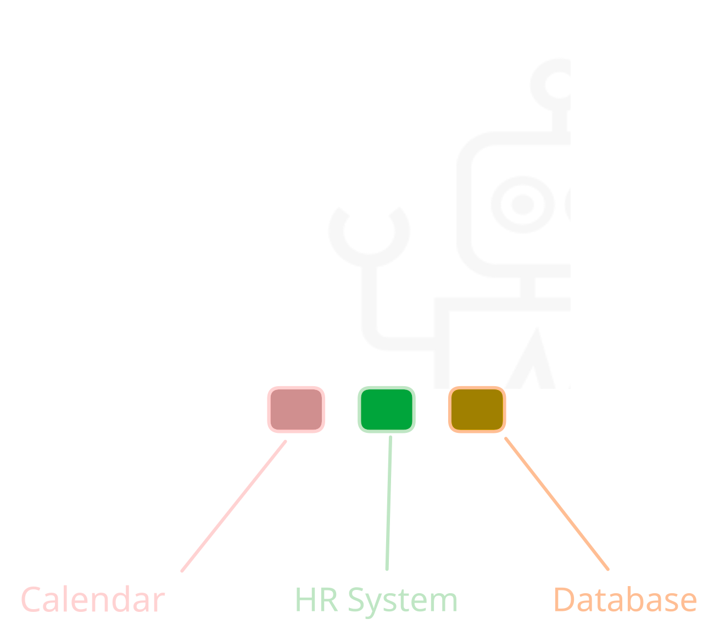
</div>
```

---

## Multi Agent Systems

```{=html}
<div style="display: flex; justify-content: space-between; align-items: center; max-width: 95%; margin: 40px auto;">
  <!-- Left side: Hierarchical Multi-Agent System -->
  <div style="width: 47%; text-align: center;">
    <div style="height: 50vh; display: flex; justify-content: center; align-items: center;">
      <!-- 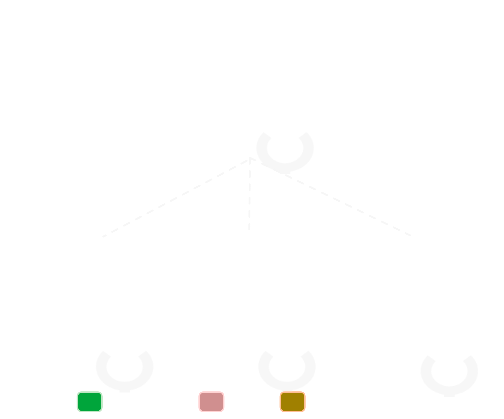 -->
      

    </div>
    <h3 style="color: #eee8d5; margin-top: 20px; font-size: 1.5em; text-align: center; font-weight: 600;">
      Hierarchical
    </h3>
  </div>

  <!-- Right side: Questions image -->
  <div style="width: 47%; text-align: center;">
    <div style="height: 50vh; display: flex; justify-content: center; align-items: center;">
      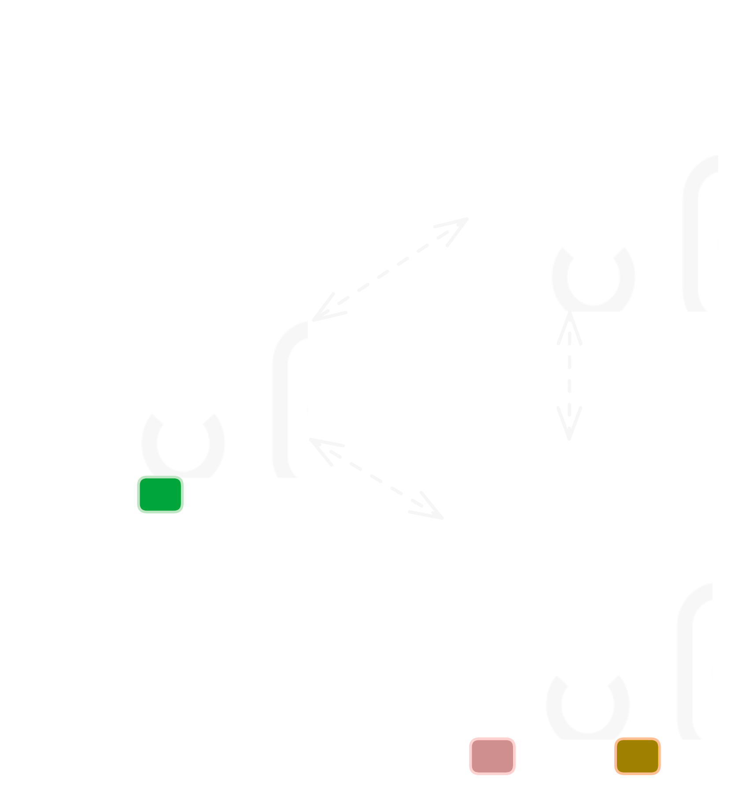
    </div>
    <h3 style="color: #eee8d5; margin-top: 20px; font-size: 1.5em; text-align: center; font-weight: 600;">
      Group
    </h3>
  </div>
</div>
```

---

## AI Agents Frameworks {.chapter-title background-gradient="linear-gradient(135deg, #073642, #268bd2)"}

```{=html}
<div style="display: flex; justify-content: center; align-items: center; width: 100%; margin-top: 15px;">
  <div style="width: 90%; background: rgba(7, 54, 66, 0.8); border-radius: 15px; padding: 20px; box-shadow: 0 8px 20px rgba(0,0,0,0.4);">

    <div style="display: grid; grid-template-columns: repeat(3, 1fr); gap: 15px; margin-top: 0px;">

      <!-- LangGraph -->
      <div style="background: #002b36; padding: 15px; border-radius: 12px; border: 2px solid #2aa198; box-shadow: 0 4px 15px rgba(0,0,0,0.3); display: flex; flex-direction: column; align-items: center; text-align: center;">
        <div style="width: 70px; height: 70px; background: #2aa198; border-radius: 50%; display: flex; justify-content: center; align-items: center; margin-bottom: 15px;">
          <span style="font-size: 2em; color: #002b36;">🔄</span>
        </div>
        <h3 style="color: #eee8d5; font-size: 1em;">LangGraph</h3>
        <!-- <p style="color: #93a1a1; font-size: 0.5em;">Build stateful, multi-actor systems with LLMs</p> -->
      </div>

      <!-- CrewAI -->
      <div style="background: #002b36; padding: 15px; border-radius: 12px; border: 2px solid #b58900; box-shadow: 0 4px 15px rgba(0,0,0,0.3); display: flex; flex-direction: column; align-items: center; text-align: center;">
        <div style="width: 70px; height: 70px; background: #b58900; border-radius: 50%; display: flex; justify-content: center; align-items: center; margin-bottom: 15px;">
          <span style="font-size: 1.5em; color: #002b36;">👥</span>
        </div>
        <h3 style="color: #eee8d5; font-size: 1em;">CrewAI</h3>
        <!-- <p style="color: #93a1a1; font-size: 0.5em;">Orchestrate role-based agents in teams</p> -->
      </div>

      <!-- Autogen -->
      <div style="background: #002b36; padding: 15px; border-radius: 12px; border: 2px solid #dc322f; box-shadow: 0 4px 15px rgba(0,0,0,0.3); display: flex; flex-direction: column; align-items: center; text-align: center;">
        <div style="width: 70px; height: 70px; background: #dc322f; border-radius: 50%; display: flex; justify-content: center; align-items: center; margin-bottom: 15px;">
          <span style="font-size: 1.5em; color: #002b36;">🤖</span>
        </div>
        <h3 style="color: #eee8d5; font-size: 1em;">Autogen</h3>
        <!-- <p style="color: #93a1a1; font-size: 0.5em;">Multi-agent conversation framework</p> -->
      </div>
    </div>

    <!-- Bottom row with centered blocks - now outside the grid for better centering -->
    <div style="display: flex; justify-content: center; gap: 15px; margin-top: 15px;">
      <!-- Agents SDK (OpenAI) -->
      <div style="background: #002b36; padding: 15px; border-radius: 12px; border: 2px solid #859900; box-shadow: 0 4px 15px rgba(0,0,0,0.3); display: flex; flex-direction: column; align-items: center; text-align: center; width: 100%; max-width: 30%;">
        <div style="width: 70px; height: 70px; background: #859900; border-radius: 50%; display: flex; justify-content: center; align-items: center; margin-bottom: 15px;">
          <span style="font-size: 1.5em; color: #002b36;">🧠</span>
        </div>
        <h3 style="color: #eee8d5; font-size: 1em;">Agents SDK</h3>
        <!-- <p style="color: #93a1a1; font-size: 0.5em;">OpenAI's toolkit for assistant applications</p> -->
      </div>

      <!-- ADK (Google) -->
      <div style="background: #002b36; padding: 15px; border-radius: 12px; border: 2px solid #6c71c4; box-shadow: 0 4px 15px rgba(0,0,0,0.3); display: flex; flex-direction: column; align-items: center; text-align: center; width: 100%; max-width: 30%;">
        <div style="width: 70px; height: 70px; background: #6c71c4; border-radius: 50%; display: flex; justify-content: center; align-items: center; margin-bottom: 15px;">
          <span style="font-size: 1.5em; color: #002b36;">🛠️</span>
        </div>
        <h3 style="color: #eee8d5; font-size: 1em;">Agent Development Kit</h3>
        <!-- <p style="color: #93a1a1; font-size: 0.5em;">Google's framework for agent creation</p> -->
      </div>
    </div>
  </div>
</div>
```

---

```{=html}
<div style="display: flex; justify-content: center; align-items: center; width: 100%; height: 70vh; padding: 20px; box-sizing: border-box;">
  
</div>
```

:::footer
Source: AI Agents Unleashed Playbook 2025, Hubspot
:::

# {background-image="img/octo-future.gif" background-size="contain" background-color="black"}

---

## Exponential growth {.chapter-title .center background-image="img/blog_exponential_growth_chart.webp" background-opacity="0.5" background-size="contain" background-color="black"}

---

## Powerlaw {background-color="white"}

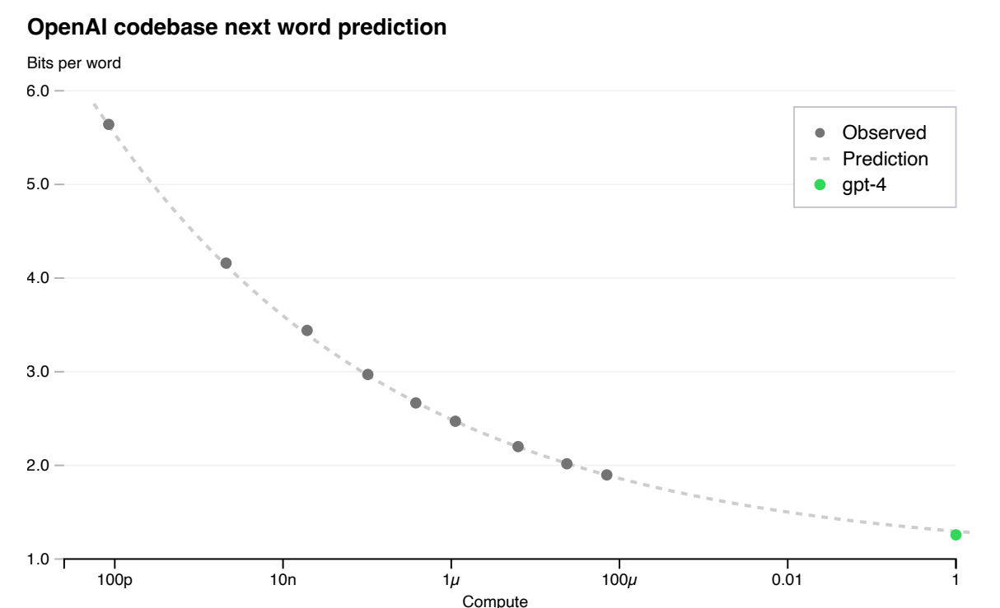

---


## {background-image="img/exponential-growth.png"  background-size="contain" background-color="white"}


:::footer
:::

---


## {background-image="img/exp-scaled-compute-dark.webp"  background-size="contain" background-color="black"}


:::footer
:::

---

## Doubling every 7 months {background-color="white"}

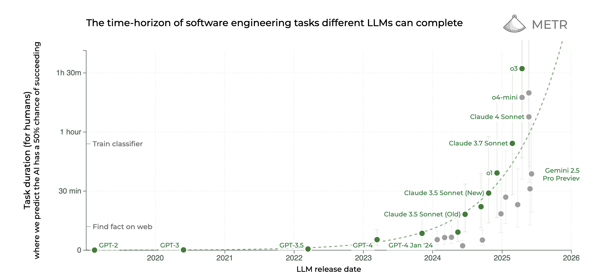


:::footer
:::

---

## Doubling every 7 months {background-color="white"}

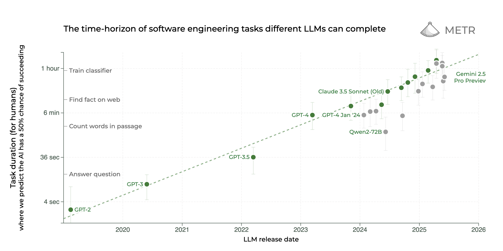


:::footer
:::


---

## {background-image="img/mad2024.jpg" style="color:black"}

<h2 style="color:darkblue; text-align: center;">200 --> 2000</h2>

:::footer
:::

---


## {background-color="rgba(7, 54, 66, 0.9)"}

```{=html}
<div style="display: flex; justify-content: center; align-items: center; height: 80vh;">
    <blockquote style="
      width: 80%;
      margin: 0 auto;
      padding: 40px 50px;
      border-left: 8px solid #2aa198;
      background: rgba(0, 43, 54, 0.7);
        font-family: 'Georgia', serif;
        position: relative;
        border-radius: 10px;
      box-shadow: 0 10px 30px rgba(0,0,0,0.4);
    ">
        <p style="
          color: #eee8d5;
          font-size: 1.5em;
            font-style: italic;
          margin-bottom: 25px;
          text-align: center;
          line-height: 1.4;
          text-shadow: 1px 1px 2px rgba(0,0,0,0.3);
      ">"The more it reasons, the more unpredictable it becomes"</p>
        <footer style="
          color: #b58900;
          font-size: 1.4em;
            text-align: right;
            font-weight: 500;
      ">— Ilya Sutskever</footer>
    </blockquote>
</div>
```

---

## Counting the OOMs

<u><em>1 OOM = 10x increase</em></u>

We can converge several trendlines:

- Compute increase is 4-5x per year (0.5 OOM)
- Algorithmic improvements is 0.5 OOMs

That combines to a 10x (or 1 OOM) increase in effective compute per year.

---

## {background-image="img/base_scaleup_effective_compute.png" background-size="contain" background-color="white"}

:::footer
:::


---

## {background-image="img/trillion-dollar-cluster.png" background-size="contain" background-color="black"}

:::footer
:::


---

## Largest training clusters per generation

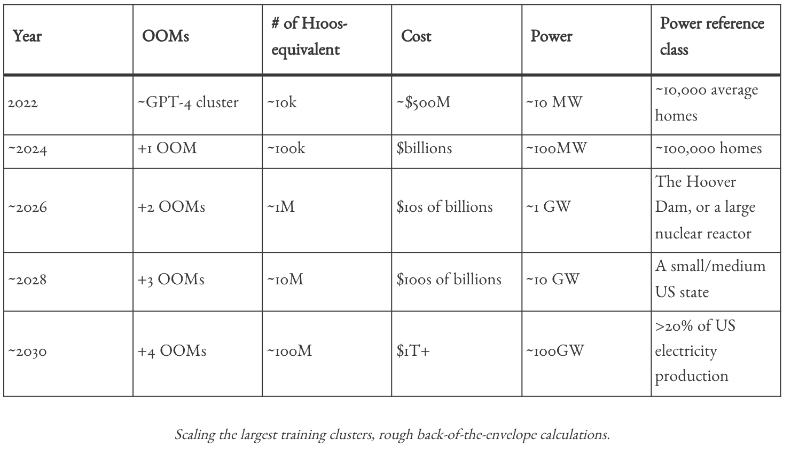

:::footer
:::

---

## {background-image="img/project-stargate.png" background-size="contain" background-color="black"}

:::footer
:::

---

## {.chapter-title background-image="img/road.jpg" color="black"}
<h2 class="chapter-title" style="color: white; border-color: black; padding: 0.5em 0; text-align: center;">From GenAI to AGI</br> Your Journey Starts Now</h2>

:::notes
The path to AGI is unfolding. By building your skills with GenAI today, you’re equipping yourself for the opportunities and challenges of tomorrow. Don’t wait—use these tools to amplify your impact and future-proof your career.
:::

---

## Questions {.chapter-title .center}

---

## Resources

- https://artificialanalysis.ai/
- epoch.ai
- metr.org